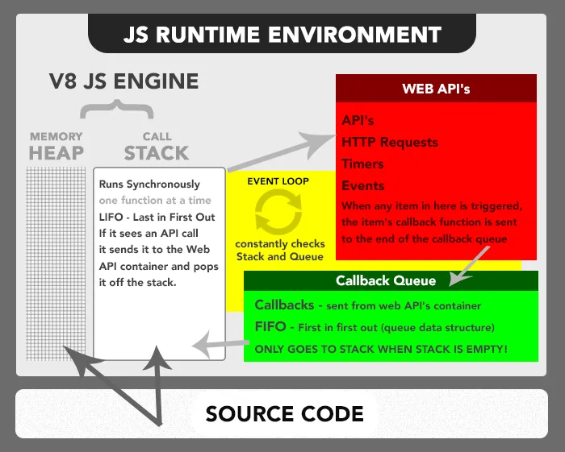

# JS运行核心概念（draft）

TODO:

- [ ] 规划该笔记的层次结构，重新组织笔记内容
- [ ] 增加微任务队列和宏任务队列的介绍
- [ ] 增加 Promise 的介绍
- [ ] 学习 [该视频](https://www.youtube.com/watch?v=8aGhZQkoFbQ&t=1s&ab_channel=JSConf) 中的讲解方式
- [ ] 重新绘制图片

## 前言

该笔记的目标是完整的记录 JS 运行相关概念。

## The Javascript Runtime Environment

不会专门解释各种数据结构的特性：

- 栈：先进后出
- 队列：先后先出
- 堆：快速查找

JS Running Environment 包含以下内容：

- JS 引擎，以 V8 JS Engine 为例
- 外部 API，比如浏览器提供的 Web API
- 任务队列，包括 Callback Queue、Render Queue 等等
- Event Loop 事件循环机制

### V8 JS Engine

V8 JS Engine 提供的是 JavaScript 语言的核心内容，ES 就是 JS 的核心。

包含两块内容：

- The Heap
    - 当 V8 引擎识别到变量或函数声明时，会将它们存储在 Heap 中
- The Stack
    - 当 V8 引擎遇到可执行块时，比如遇到一个函数调用时，会将该函数入栈。
    - 当该函数调用一个新的函数时，会将新函数入栈
    - 当该函数返回一个值时，该函数会出栈
    - 当函数调用一个 Web API 时，该函数也会出栈。
    - 当函数被执行完，并且明确没有 return 值时，JS 引导会返回返回一个 undefined，然后将该函数出栈。
    - “函数入栈——>执行函数——>函数出栈”这个过程就是 JS 引擎的单线程，在同一时间内只有一个一个线程，执行一件事。

### The Web API Container

当在 The Stack 中调用一个 WEB API 时（比如事件监听、HTTP/AJAX 请求，或 setTimeout/setInterval），WEB API 将会被送到 The Web API Container 中执行。同时 The Stack 中对应的函数也会出栈。

当 WEB API 执行完毕（比如某个监听的事件被触发、网络请求收到相应数据、计时器到时）时，其对应的回调函数将会被发送到 callback queue 中。

### The Callback Queue

回调队列会按序存储添加进该队列中的回调函数，然后等待 The Stack 空。当执行栈为空时，就会将一个回调函数送入栈中执行。当执行栈再次为空时，将会再次添加一个回调函数。

Callback Queue 是怎么知道执行栈为空的呢？是 Event Loop 告诉它的

### The Event Loop

事件循环是一种运行机制。它不像前面的内容，V8 JS Engine（Heap, Stack）、The WEP API Container、Callback Queue，可以很形象知道有对应的内存空间。

这样理解比较容易，堆、栈、队列、The WEP API Container 这些内容就像是代码中的“类”，有具体的内存空间。而事件循环就像是一系列的 if else while 语句，它表示的是逻辑、运行机制，它没有具体的内存空间，但它对理解代码如何运行非常重要。

事件循环的工作是查看执行栈和回调队列的状态，当它看到执行栈为空时，它会通知回调队列，于是回调队列就会将一个回调函数送入栈中执行。

执行栈和回调队列可能同时为空，但事件循环机制会不断地检测，就像一个 while 循环一样。这样一来，当 WEB API 中触发一个行为（监听到事件、请求到响应、计时器到时）时，会将对应的回调函数添加到回调队列中，此时事件循环可以立马知道。

这就是为什么有些人认为 js 是异步的，但其实这并不准确，因为 JS Engine 始终是单线程的，只不过 WEB API 是异步执行的，但严格来说 WEB API 并不属于 JS 范畴，它是由浏览器负责的。

### 为什么说 JS 是单线程，但又被称为非阻塞的的？

首先， JS 是非阻塞 I/O 并不意味着 JS 真的不会被阻塞。

比如你将一个死循环送到栈中执行，或者将一个耗时很长的函数送到栈中执行，那么 JS 将会被阻塞。但这种阻塞是程序员的问题，并不是 JS 语言特性所导致的。

在栈中运行一个死循环的结果是：该函数永远不会出栈、栈中其他函数永远在等待，回调队列中的回调函数永远没有机会加入到栈中。

我们所说的 JS 是非阻塞，考虑的是这种情况：你发起一个请求，该请求永远不会响应，但 JS 依旧可以继续执行栈中剩余的函数，也可以执行回调队列送进来的函数。这是因为，当栈中函数发起一个请求（调用 WEB API）时，该函数就会出栈了，剩下的逻辑（回调函数）想要继续执行，必须得通过回调队列送入执行栈。

## 参考资料

- [The Javascript Runtime Environment](https://olinations.medium.com/the-javascript-runtime-environment-d58fa2e60dd0)
- [What the heck is the event loop anyway? | Philip Roberts | JSConf EU](https://www.youtube.com/watch?v=8aGhZQkoFbQ&t=1s&ab_channel=JSConf)
